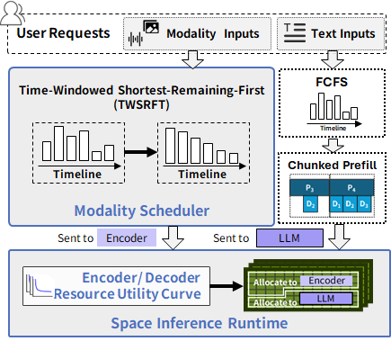

<h1 align="center">SpaceServe: Encoder–LLM Concurrent Inference on vLLM</h1>

SpaceServe is a vLLM‑based inference runtime for multimodal (especially vision–language) models. It decouples the vision encoder from LLM decoding and runs them in parallel, improving throughput and concurrency while reducing end‑to‑end latency. The system keeps an OpenAI‑compatible API for seamless integration.

## Highlights

- Parallel encoder–decoder execution: encoder and decoder run as cooperating processes with batched, pipelined computation.
- Encoder‑aware scheduling: decoding only advances when necessary encoder features are ready; avoids wasted work and smooths latency.
- Lightweight encoder cache: inter‑process cache for encoder outputs with automatic release after consumption by the decoder.
- OpenAI‑compatible serving: keep your existing client and tooling; streaming and tensor parallelism remain supported by vLLM.
- Optional GPU SM partitioning (experimental): reduce interference between encoder and decoder kernels on the same GPU.

## Architecture (overview)

<p align="center">
  
  <br/>
  <em>High‑level dataflow and scheduling in SpaceServe.</em>
  
</p>

## Environment Setup

Prerequisites
- Python 3.10 or 3.11
- NVIDIA GPU with CUDA recommended
- PyTorch 2.5.1 (pinned in this repo)

Install (CUDA)
```bash
pip install -r requirements-cuda.txt
pip install -e .
```

CPU or alternative devices: see the corresponding `requirements-*.txt` files.

## Run the Server

Enable the vLLM V1 inner loop (required):
```bash
export VLLM_USE_V1=1
```

Start the OpenAI-compatible server (example with Qwen2-VL-7B):
```bash
python -m vllm.entrypoints.openai.api_server \
  --model Qwen/Qwen2-VL-7B-Instruct \
  --gpu-memory-utilization 0.8 \
  --port 7778 \
  --enforce-eager
```

Quick health check:
```bash
curl http://127.0.0.1:7778/v1/models
```

Optional local benchmark clients:
```bash
bash ./client_qwen2vl_7b.sh
```

## Notes

- Default throughput knobs: `--max-num-batched-tokens` and `--max-num-seqs`.
- Multimodal preprocessing and per‑prompt limits are supported via vLLM flags (e.g., `--limit-mm-per-prompt`, `--mm-processor-kwargs`).
- SM partitioning is experimental and requires a local `libsmctrl`
  installation. Set `VLLM_LIBSMCTRL_PATH=/path/to/libsmctrl.so` or add the
  library directory to `LD_LIBRARY_PATH`.
